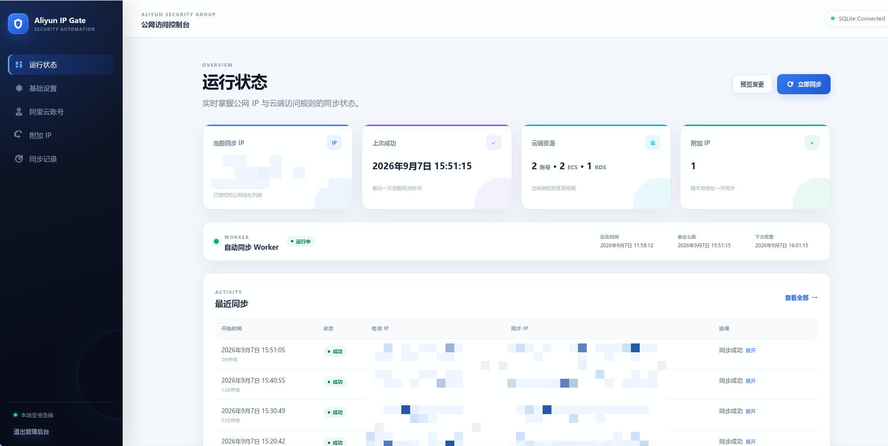

# Aliyun IP Gate

定时获取本机公网 IPv4，并同步到多个阿里云账号下的 ECS 安全组和 RDS IP 白名单。配置通过本地 Web 管理后台保存到 SQLite，支持附加 IP、地域限制、飞书通知和同步记录。



## 安装

需要 Python 3.11 或更高版本。

```bash
python -m pip install -r requirements.txt
cp .env.example .env
chmod 600 .env
```

数据库默认保存到 `data/app.db`，首次启动时自动创建，目录权限为 `700`，数据库文件权限为 `600`。

首次使用时先启动 Web 管理后台并完成配置，再启动定时同步 Worker。

`.env` 仅用于 Web 服务启动参数：

```dotenv
WEB_PORT=17321
WEB_ACCESS_TOKEN=replace_with_a_long_random_token
```

修改端口或访问 Token 后需要重启 Web 服务。Worker、阿里云账号及同步设置均不读取 `.env`。

## 运行

启动定时同步 Worker：

```bash
python main.py
```

仅执行一轮：

```bash
python main.py --once
```

启动本地 Web 管理后台：

```bash
python web.py
```

后台监听全部本机网络接口，端口由 `WEB_PORT` 配置，可通过本机、局域网或 Tailscale IP 访问。打开管理后台后，输入 `WEB_ACCESS_TOKEN` 验证访问身份。

## PM2

```bash
pm2 start "python main.py" --name syncServerIP-worker
pm2 start "python web.py" --name syncServerIP-web
pm2 save
```

更新代码或配置运行环境后：

```bash
pm2 restart syncServerIP-worker --update-env
pm2 restart syncServerIP-web --update-env
```

## Tailscale

如需使用 Tailscale Serve 提供 HTTPS 入口，可转发到本机 Web 服务：

```bash
tailscale serve --bg http://127.0.0.1:17321
tailscale serve status
```

建议在 Tailscale ACL 中仅允许自己的用户或设备访问。Web 后台同时使用 `WEB_ACCESS_TOKEN` 验证访问身份。

## Web 配置

后台提供以下功能：

- 查看当前同步 IP、最近成功时间、最近错误和同步记录。
- 配置检查间隔、地域限制、ECS 规则描述和 RDS 白名单名称。
- 配置 IPInfo Token 和飞书 Webhook；敏感值不会回显。
- 管理多个阿里云账号及其 ECS 安全组、RDS 实例。
- 对单个账号执行只读连接测试，检查凭证和目标资源是否可读取。
- 管理需要一并同步的附加 IPv4 地址。
- 在执行同步前预览每个资源预计新增、删除或保持不变的 IP。
- 手动触发一次同步；文件锁会阻止 Worker 和 Web 并发执行。
- 查看 Worker 启动时间、最近心跳、下次检查时间和资源级同步结果。
- 查看同步记录总数，并按需清除全部历史记录。

Web 登录状态使用签名 Session，Token 变更并重启服务后，已有登录状态会失效。配置表单均包含 CSRF 校验。AccessKey Secret、IPInfo Token 和飞书 Webhook 保存在本机 SQLite 中，请限制 `.env` 和数据库文件的读取权限并定期备份。

## 同步规则

- ECS 规则描述使用 `前缀:1`、`前缀:2` 格式，只管理配置前缀及其严格编号规则。
- 安全组没有同步规则时，自动创建 `TCP`、`1/65535`，即 TCP 全端口规则。
- 如需其他协议或端口，先手工创建描述为配置前缀的单 IPv4 模板规则，程序会沿用其规格。
- ECS 通常先创建新规则再删除旧规则，不会删除其他描述的规则。
- RDS 使用独占白名单分组并以覆盖模式同步，禁止使用 `default`。
- IP 不符合地域限制时不会修改已有安全组或白名单。
- 每轮都会校验云端配置；IP 列表变化并同步成功后才发送飞书通知。

## RAM 权限

创建自定义策略并授权给 AccessKey 所属的 RAM 用户：

```json
{
  "Version": "1",
  "Statement": [
    {
      "Effect": "Allow",
      "Action": [
        "ecs:DescribeSecurityGroupAttribute",
        "ecs:AuthorizeSecurityGroup",
        "ecs:RevokeSecurityGroup",
        "rds:DescribeDBInstanceIPArrayList",
        "rds:ModifySecurityIps"
      ],
      "Resource": "*"
    }
  ]
}
```

只使用 ECS 或 RDS 时，可以删除另一类权限。

## 测试

测试使用临时 SQLite 和模拟客户端，不会调用真实阿里云或飞书接口：

```bash
python -m unittest discover -s tests -v
```
